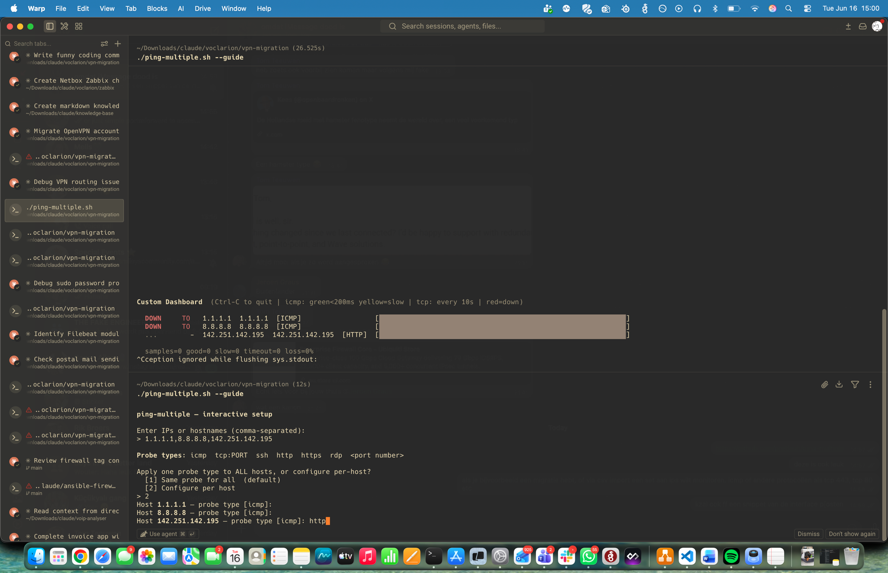
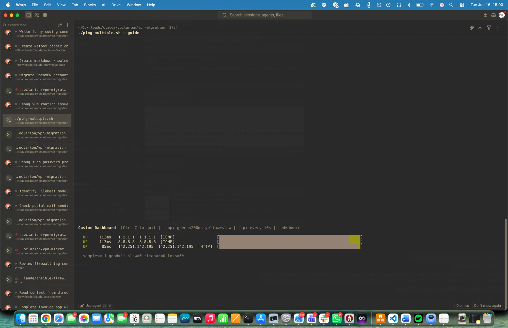
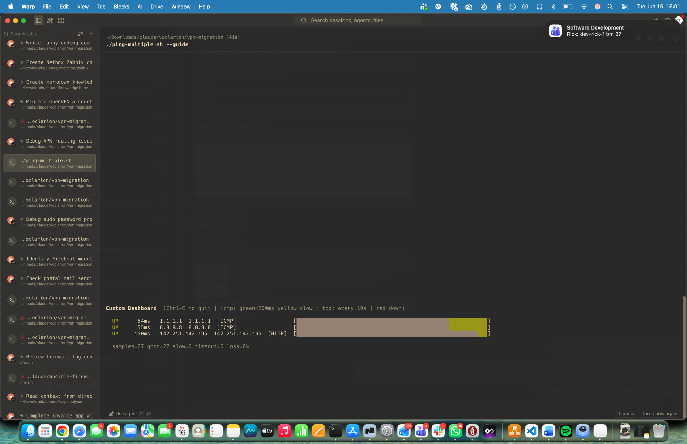

# ping-multiple.sh

A live terminal dashboard that monitors multiple hosts simultaneously using ICMP ping or TCP port checks, and displays a rolling colour-coded history bar for each target.

## What it does

- Monitors any number of IPs or hostnames in parallel
- Supports **ICMP ping** and **TCP port checks** (SSH, HTTP, HTTPS, or any port) per target
- Shows a scrolling 60-sample colour bar per host — green for up/fast, yellow for slow, red for down, gray for no data yet
- Reports the latest round-trip time and an aggregate loss summary
- Import targets from a **CSV file** or use the interactive **guided wizard**
- Uses two concurrent probe cadences for ICMP targets:
  - **Fast probe** — every 1 s with a 1 s deadline, drives the rolling bar
  - **Slow probe** — every 5 s with a 5 s deadline, drives the RTT column when it has a fresher reading
- TCP probes run every 10 s and report connect latency

## Requirements

- bash 4+ (macOS ships bash 3; install via Homebrew: `brew install bash`)
- `ping`, `nc`, `awk`, `date`, `mktemp` on PATH
- GNU `timeout` or `gtimeout` recommended on macOS (via `brew install coreutils`) — prevents `nc` from hanging on unreachable TCP targets
- `python3` only as a fallback if `date +%s%3N` is unavailable

## Usage

### Quick start — ICMP ping

Prompt for destinations interactively:

```
./ping-multiple.sh
```

Pass destinations directly as a comma-separated list:

```
./ping-multiple.sh 8.8.8.8,1.1.1.1
./ping-multiple.sh google.com,cloudflare.com,example.com
```

### Interactive wizard

Asks for a list of hosts, then lets you choose a probe type for all hosts or configure each one individually:

```
./ping-multiple.sh --guide
```

Example session:

```
ping-multiple — interactive setup

Enter IPs or hostnames (comma-separated):
> 8.8.8.8,10.0.0.1,myserver.example.com

Probe types:  icmp  tcp:PORT  ssh  http  https  rdp  <port number>

Apply one probe type to ALL hosts, or configure per-host?
  [1] Same probe for all  (default)
  [2] Configure per host
> 2
Host 8.8.8.8 — probe type [icmp]: icmp
Host 10.0.0.1 — probe type [icmp]: tcp:80
Host myserver.example.com — probe type [icmp]: ssh
```

### CSV import

Load targets from a CSV file:

```
./ping-multiple.sh --csv targets.csv
```

CSV format — header row is optional, label and probe are optional columns:

```csv
ip,label,probe
8.8.8.8,Google DNS,icmp
1.1.1.1,Cloudflare DNS,icmp
10.0.0.1,Web server,tcp:80
10.0.0.2,Database,tcp:5432
192.168.1.1,Gateway,icmp
mail.example.com,Mail server,tcp:25
```

### Probe type reference

| Value | Meaning |
|-------|---------|
| `icmp` | ICMP ping (default) |
| `tcp:PORT` | TCP connect to any port |
| `ssh` | Shorthand for `tcp:22` |
| `http` | Shorthand for `tcp:80` |
| `https` | Shorthand for `tcp:443` |
| `rdp` | Shorthand for `tcp:3389` |
| `8080` | Bare port number, treated as `tcp:8080` |

Press **Ctrl-C** to quit. The terminal cursor and temp files are cleaned up automatically on exit.

## Screenshots

**Interactive setup wizard (`--guide`)**



**Dashboard — warming up**



**Dashboard — after ~40 seconds**



## Display columns

```
UP    12ms   8.8.8.8  Google DNS  [ICMP]  [████████████████████]
UP   162ms   10.0.0.1  Web server  [HTTP]  [████████████████████]
DOWN   TO    10.0.0.2  Database  [TCP:5432]  [████████████████████]
```

| Column | Meaning |
|--------|---------|
| Status | `UP` / `SLOW` / `DOWN` / `...` (waiting for first sample) |
| RTT | Latest round-trip time; `TO` = timeout; trailing `s` = reading from slow probe (ICMP) |
| Host | IP or hostname as supplied |
| Probe | Probe type in brackets |
| Bar | 60 most-recent probe results, newest on the right |

A summary line at the bottom shows total sample counts and overall loss percentage across all hosts.

## Configuration

The thresholds are plain variables near the top of the script:

| Variable | Default | Meaning |
|----------|---------|---------|
| `FAST_INTERVAL` | 1 | Seconds between fast ICMP probes |
| `FAST_TIMEOUT` | 1 | Deadline for each fast ICMP probe (seconds) |
| `SLOW_INTERVAL` | 5 | Seconds between slow ICMP probes |
| `SLOW_TIMEOUT` | 5 | Deadline for each slow ICMP probe (seconds) |
| `SLOW_MS` | 200 | RTT threshold (ms) above which an ICMP reply is yellow |
| `HISTORY` | 60 | Number of samples kept in the rolling bar |
| `COUNT` | 2 | ICMP packets sent per probe |
| `TCP_INTERVAL` | 10 | Seconds between TCP probes |
| `TCP_TIMEOUT` | 5 | Connect timeout for TCP probes (seconds) |

## Permissions

`ping` requires the ability to send raw ICMP packets. On most Linux systems this is granted via a capability on the binary (`cap_net_raw`). If you see permission errors, either run with `sudo` or check that `ping` has the required capability:

```
sudo setcap cap_net_raw+ep /usr/bin/ping
```

TCP checks use `nc` and do not require elevated privileges.

## Changelog

### v1.2.0 — 2026-06-16
- Added TCP port probe support (`tcp:PORT`) — monitor SSH, HTTP, HTTPS, or any TCP service per target
- Added `--guide` interactive wizard: enter hosts then choose probe type for all or per-host
- Added `--csv FILE` import: load targets from a CSV file with `ip,label,probe` columns
- Added probe type shorthand aliases: `ssh`, `http`, `https`, `rdp`, bare port numbers
- Each target displays its probe type label in the dashboard
- Fixed macOS `nc` connect-timeout hang by wrapping with GNU `timeout`/`gtimeout`

### v1.1.0 — 2026-06-11
- Initial public release
- Dual fast/slow ICMP probe model
- Rolling 60-sample colour bar per host
- Aggregate loss summary line

## License

MIT
